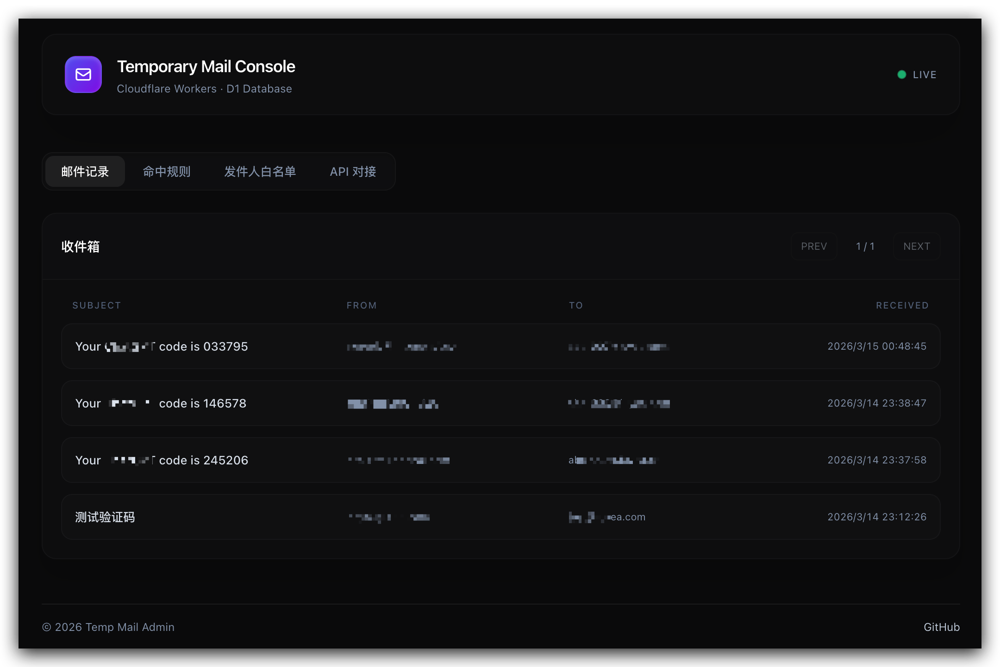
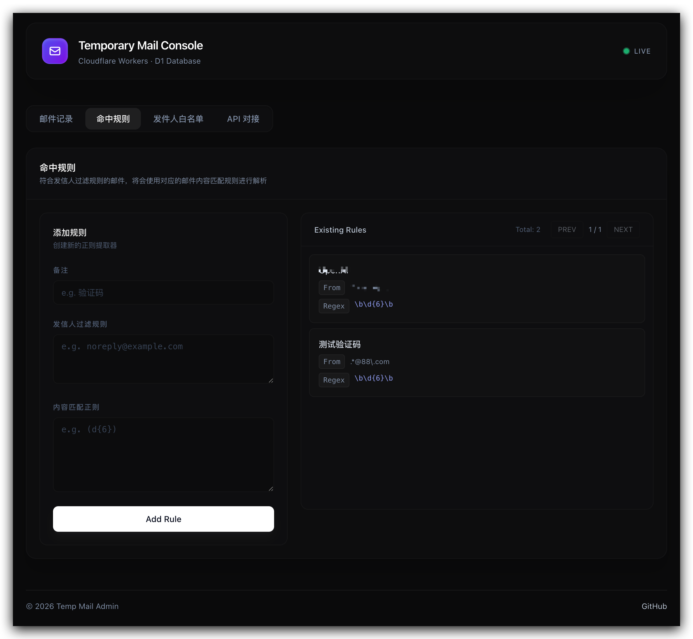
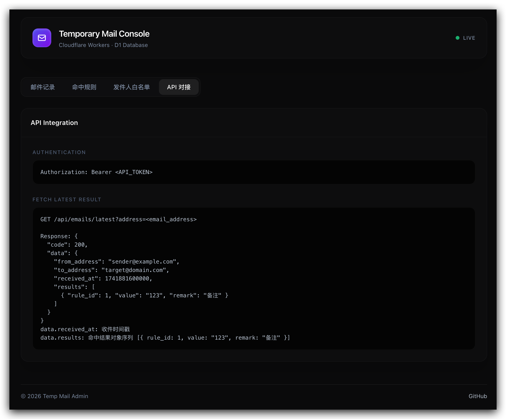

# Temp Mail Console

基于 **Cloudflare Workers + D1** 的临时邮箱控制台。接收邮件后，根据可配置的正则规则自动提取关键数据（如验证码），并通过 API 对外提供查询能力。

## 功能

- 🧩 **控制台管理**：邮件列表、规则管理、白名单管理与 API 对接说明。
- 🛡️ **发件人白名单**：基于正则表达式过滤发信人，不匹配直接忽略。
- 🔍 **内容正则提取**：对邮件正文进行正则匹配，提取验证码等关键信息。
- 🖥️ **RESTful API**：对外提供查询接口，便于系统集成。
- 🔄 **全局邮件转发**：入库后可自动转发原始邮件到真实邮箱。
- 🧹 **记录自动清理**：Cron 每小时清理 48 小时前的历史数据，防止数据库膨胀。
- ☁️ **无服务器架构**：基于 Cloudflare Workers + D1，支持低成本托管。

## 界面预览

<table>
  <tr>
    <td align="center"></td>
    <td align="center"></td>
    <td align="center"></td>
  </tr>
</table>


## 快速开始

### 方式一：一键部署（推荐）

[](https://deploy.workers.cloudflare.com/?url=https://github.com/beyoug/temp-mail-console)

> 点击上方按钮可全自动 Fork 并在你的 Cloudflare 账户上部署该项目，自动分配 D1 数据库资源。部署后别忘了按下方指南设置必须的环境变量（如 ADMIN_TOKEN 和 API_TOKEN）以及邮件路由。

> 提示：最新版本在首次访问控制台或收到第一封邮件时会自动初始化表结构。如果希望提前手动初始化，可在本地执行 `npx wrangler d1 execute temp-email-db --file=schema.sql`（使用远程 DB）。

---

### 方式二：手动部署

### 1. 安装依赖

```bash
npm install
```

### 2. 创建 D1 数据库（首次）

```bash
# 创建远程数据库
npx wrangler d1 create temp-email-db

# 将输出的 database_id 填入 wrangler.toml
```

### 3. 初始化表结构

```bash
# 本地
npx wrangler d1 execute temp-email-db --local --file=schema.sql

# 远程（正式部署后）
npx wrangler d1 execute temp-email-db --file=schema.sql
```

> 说明：最新版本会在首次请求时自动创建表结构，以上命令可用于手动初始化或重新修复表结构。

### 4. 配置 wrangler.toml

```toml
[[d1_databases]]
binding = "DB"
database_name = "temp-email-db"
database_id = "your-d1-database-id"   # 替换为实际 ID

[vars]
ADMIN_TOKEN = "your-admin-token"   # 后台登录密码
API_TOKEN = "your-api-token"

# [可选] 开启后自动转发原始邮件（该邮箱需在 Cloudflare Email Routing 的 Destination addresses 中完成验证）
# FORWARD_TO = "your-real@email.com"

[triggers]
crons = ["0 * * * *"] # 每小时执行一次，自动清理超过 48 小时的数据库记录
```

> ⚠️ 生产环境建议通过 `wrangler secret put` 设置 `ADMIN_TOKEN` 和 `API_TOKEN`，不要写在 `wrangler.toml` 中。

### 5. 本地开发

```bash
npm run dev
# 访问 http://localhost:8787
```

### 6. 部署

```bash
npm run deploy
```

### 7. 配置邮件路由 (Email Routing)

- 在 Cloudflare 控制台左侧菜单，找到 **Email** -> **Email Routing**
- 进入 **Routes** 配置页
- 根据需要配置 **Catch-all address** 或具体的 **Custom addresses** (Destination 均选择 `Send to a Worker`，并选择刚才部署的 `temp-email-worker`)。

> [!IMPORTANT]
> 当你在 Cloudflare 邮件路由中将动作设置为 **"Send to a Worker"** 时，Cloudflare **不再**会自动将该邮件投递/转发到你原本的个人收件箱。Worker 会完全接管这条邮件的处理权。
> **如何启用自动转发**：如果你希望 Worker 提取数据的同时，也将原邮件转发到你的真实邮箱，可以通过 `wrangler dev` 环境变量或在 Cloudflare 控制台的该 Worker **Settings -> Variables** 中增加 `FORWARD_TO` 变量，值为你的真实收件箱地址（注意：该接收地址必须是在 Cloudflare Email Routing 中已验证过的 Destination Address）。

## 邮件转发配置

1. 在 Cloudflare **Email Routing** 的 **Destination addresses** 中添加并验证你的真实邮箱。
2. 在 Worker 变量中设置 `FORWARD_TO`：

```bash
# 本地开发（dev）
FORWARD_TO="your-real@email.com" npm run dev

# 线上环境（推荐使用 secret）
npx wrangler secret put FORWARD_TO
```

3. 生产环境也可在 Cloudflare 控制台 Worker **Settings -> Variables** 中添加 `FORWARD_TO`。

> 提示：当 `FORWARD_TO` 为空时不会执行转发，仍会正常入库与规则解析。

## 管理控制台

- 访问 `https://<your-worker-domain>/`，输入 `ADMIN_TOKEN` 登录。
- 登录成功后会写入 `admin_token` Cookie；也可以通过 `Authorization: Bearer <ADMIN_TOKEN>` 访问 `/admin/*` 接口。

### API 鉴权

```
Authorization: Bearer <API_TOKEN>
```

### 查询最新命中结果

```
GET /api/emails/latest?address=<email_address>
```

**响应：**

```json
{
  "code": 200,
  "data": {
    "from_address": "noreply@example.com",
    "to_address": "user@yourdomain.com",
    "received_at": 1741881600000,
    "results": [
      { "rule_id": 1, "value": "123456", "remark": "验证码" }
    ]
  }
}
```

| 字段 | 说明 |
|------|------|
| `from_address` | 发件人邮箱 |
| `to_address` | 收件人邮箱（多个收件人时用逗号分隔） |
| `received_at` | 收件时间戳（毫秒） |
| `results` | 命中结果数组，每项包含 `rule_id`、`value`、`remark` |

**错误响应：**

```json
{ "code": 404, "message": "message not found" }
```

## 规则说明

每条规则由三部分组成：

| 字段 | 说明 |
|------|------|
| `remark` | 备注名称，作为返回结果的标签（可选） |
| `sender_filter` | 发信人过滤，支持正则，多个用逗号或换行分隔，留空匹配所有 |
| `pattern` | 内容提取正则，对邮件正文匹配，取第一个完整匹配 |

## 白名单说明

- 白名单为空时接受所有邮件。
- 白名单规则支持正则表达式，匹配不通过的发件人将被直接忽略。

**示例**：提取来自 `example.com` 的6位验证码

| 字段 | 值 |
|------|----|
| remark | `验证码` |
| sender_filter | `.*@example\.com` |
| pattern | `\b\d{6}\b` |

## 本地测试

**发送测试邮件（触发 email handler）：**

```bash
curl -X POST "http://localhost:8787/cdn-cgi/handler/email?from=sender@example.com&to=demo@yourdomain.com" \
  --data-binary @./test/sample.eml
```

**查询最新命中结果：**

```bash
curl "http://localhost:8787/api/emails/latest?address=demo@yourdomain.com" \
  -H "Authorization: Bearer dev-api-token"
```

## 项目结构

```
├── src/
│   └── index.js        # Worker 入口（邮件处理 + HTTP 路由 + 前端页面）
├── test/
│   └── sample.eml      # 本地测试用示例邮件
├── images/             # README 截图
├── schema.sql          # D1 建表语句
├── wrangler.toml       # Wrangler 配置
└── package.json
```

## License

MIT
